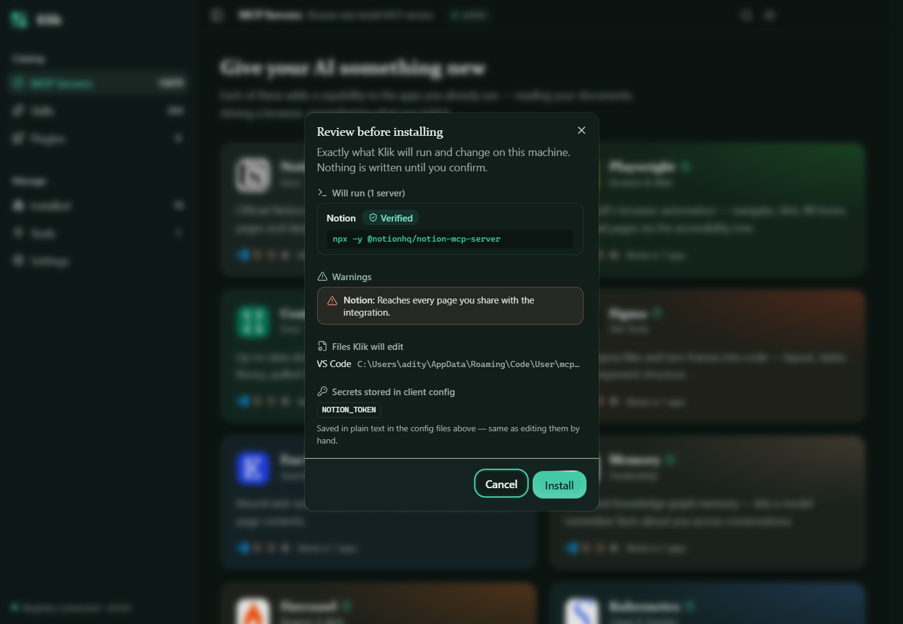

# Klik

[](https://github.com/adityasingh38/klik/actions/workflows/ci.yml)
[](LICENSE)

**One-click MCP server installer for Windows.**

Browse the [Model Context Protocol](https://modelcontextprotocol.io) registry, pick the servers you
want, and install them straight into Claude Desktop, Cursor, or VS Code. No manual JSON config
editing, no restarting five times to see if you got the syntax right.


Nothing is written to your machine until you confirm. Every install shows the exact command that
will run, the files it will edit, any secrets that get stored, and what the server will have access
to.



## Why

Installing an MCP server today usually means: finding the right package name, hand-editing a client's config file, guessing at the right `command`/`args` shape, providing any required API keys, and restarting the client to find out if it worked. Multiply that by every server you want and every client you use.

Klik turns that into: search, check a box, click install.

## Features

- **Live registry browsing.** Pulls from the official MCP registry, with instant load from a local cache while it refreshes in the background.
- **Multi-client install.** Install the same server into Claude Desktop, Cursor, and VS Code in one pass.
- **Secret prompting.** If a server needs an API key or other required env var, Klik asks for it inline before installing, instead of failing silently at runtime.
- **Clean uninstall.** Remove a server from a client without hand-editing config files.
- **Curated overlay.** A small curation layer marks trusted servers as "Verified" on top of the raw registry data.
- **Offline-friendly.** A local cache means the server list is usable even without a fresh network round-trip every launch.

## Install

Download the latest installer from the [Releases](../../releases) page and run it. Klik installs to your machine like any normal Windows app. No admin rights, no terminal required.

## Supported clients

| Client | Status |
|---|---|
| Claude Desktop | ✅ |
| Cursor | ✅ |
| VS Code | ✅ |

Klik detects which of these are actually installed on your machine and only lets you target the ones that are.

## Development

```bash
git clone https://github.com/adityasingh38/klik.git
cd klik
npm install
npm run dev          # start the app in dev mode
```

Other scripts:

```bash
npm test             # run the test suite (vitest)
npm run typecheck    # type-check main + renderer
npm run build:win    # produce a Windows installer in release/
```

### Stack

Electron (`electron-vite`) + React 19 + TypeScript, Tailwind v4 (CSS-first config) with shadcn/ui (`base-nova` style) and [Magic UI](https://magicui.design) for motion, `@base-ui/react` primitives under the hood.

## Contributing

Issues and PRs welcome. If you're adding a new target client, look at `src/main/clients/`. Each client is a small, self-contained adapter (`detect`, `configFileAdapter`, etc.) implementing a shared interface, so a new one is a new file, not a rewrite.

## License

[MIT](LICENSE)
