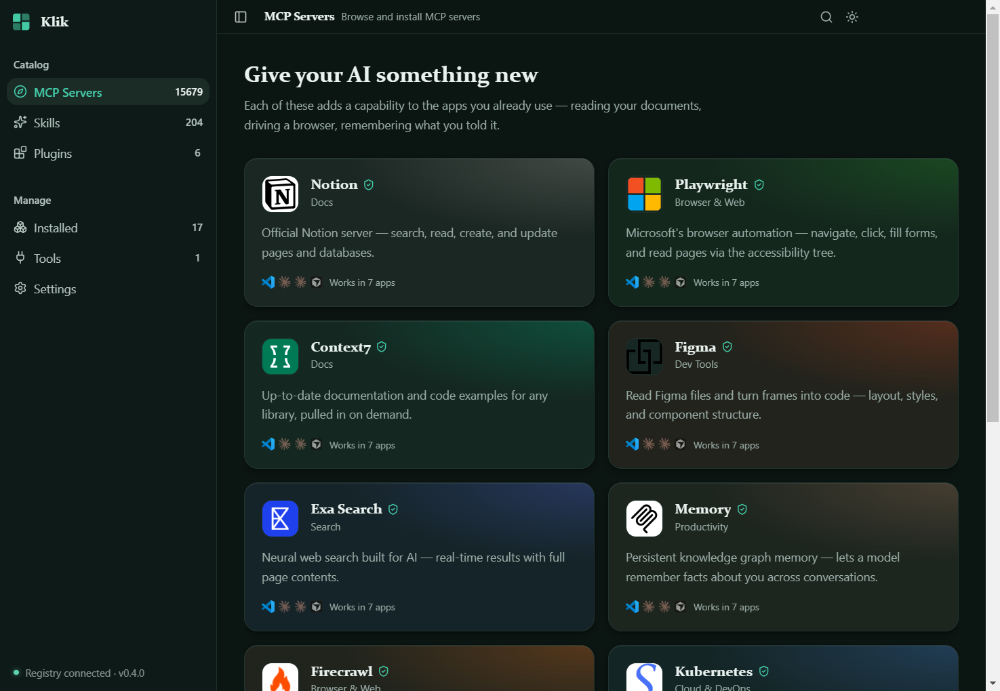

# Klik

[](https://github.com/adityasingh38/klik/actions/workflows/ci.yml)
[](LICENSE)

**Equip your AI tools, without editing a single config file.**

Klik installs [Model Context Protocol](https://modelcontextprotocol.io) servers, agent skills and
plugins into the AI tools you already use — Claude Desktop, Claude Code, Cursor, VS Code and more.
Browse, pick, confirm. No manual JSON editing, no restarting five times to see if you got the
syntax right.



Nothing is written to your machine until you confirm. Every install shows the exact command that
will run, the files it will edit, any secrets that get stored, and what the server will have access
to.

## Why

Installing an MCP server by hand means: finding the right package name, editing a client's config file, guessing at the right `command`/`args` shape, supplying any required API keys, and restarting the client to find out if it worked. Multiply that by every server you want and every tool you use.

Klik turns that into: search, check a box, click install.

## What you can install

- **MCP servers** — 15,000+ from the official registry, ranked so the significant ones surface first, with a curated set verified by hand.
- **Skills** — on-demand capabilities your AI loads when a task needs them, discovered across several public marketplaces rather than a hand-written list.
- **Plugins** — bundles of commands, agents, hooks, skills and MCP servers, installed through Claude Code's own CLI.

## Features

- **Honest compatibility.** Each item shows which tools can actually accept it, derived from how it works rather than guessed — a stdio server won't claim to run in a remote-only client.
- **Multi-tool install.** Install the same server into several tools in one pass.
- **Secret prompting.** If a server needs an API key or other required env var, Klik asks for it inline before installing, instead of failing silently at runtime.
- **Clean uninstall.** Remove something from a tool without hand-editing config files.
- **Offline-friendly.** A local cache means the catalogue is usable without a fresh network round-trip every launch.
- **Light and dark**, both designed rather than inverted.

## Install

Download the latest installer from the [Releases](../../releases) page and run it. Klik installs to your machine like any normal Windows app. No admin rights, no terminal required.

The installer is not yet code-signed, so Windows SmartScreen will warn you the first time you
run it — choose **More info → Run anyway**. See the [code signing policy](docs/code-signing-policy.md)
for how signed builds are produced and what the signature does and doesn't tell you.

## Supported tools

These are the tools Klik can install **into**:

| Tool | MCP servers | Skills | Plugins |
|---|---|---|---|
| Claude Desktop | ✅ | | |
| Cursor | ✅ | | |
| VS Code | ✅ | | |
| Claude Code | | ✅ | ✅ |

Klik detects which of these are actually installed on your machine and only lets you target the ones that are.

Cards also show badges for tools Klik **doesn't** install into — Windsurf, Zed, Cline, ChatGPT. Those say
"this server will work there," which is a fact about the server, not a promise that Klik can set it up for
you. The two are deliberately kept distinct.

## Development

```bash
git clone https://github.com/adityasingh38/klik.git
cd klik
npm install
npm run dev          # start the app in dev mode
```

Other scripts:

```bash
npm test             # run the test suite (vitest)
npm run typecheck    # type-check main + renderer
npm run build:win    # produce a Windows installer in release/
```

### Stack

Electron (`electron-vite`) + React 19 + TypeScript, Tailwind v4 (CSS-first config) with shadcn/ui (`base-nova` style) and [Magic UI](https://magicui.design) for motion, `@base-ui/react` primitives under the hood.

## Contributing

Issues and PRs welcome. If you're adding a new target client, look at `src/main/clients/`. Each client is a small, self-contained adapter (`detect`, `configFileAdapter`, etc.) implementing a shared interface, so a new one is a new file, not a rewrite.

## License

[MIT](LICENSE)
